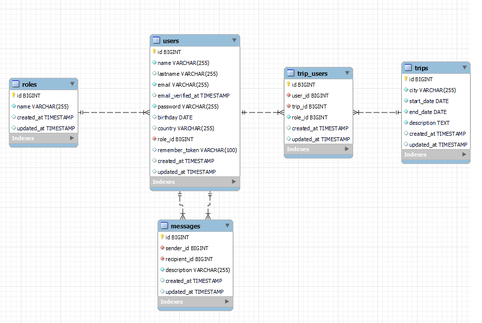
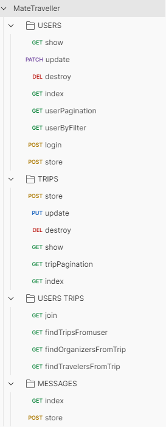
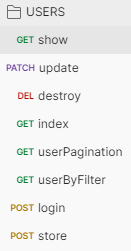
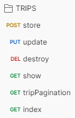
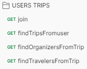
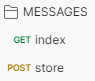

# Mate Traveler FrontEnd - PHP | Laravel

Hello there!

This is the backend of my latest project at GeeksHubs Academy. I have used PHP and Laravel as the main technologies to learn another language due to my last project was done with Express and MongoDB. I used laravel because is a powerful PHP framework that provides a robust routing system, built-in authentication and authorization, ORM capabilities and a large community providing libraries and packages.
 

In this API you can find data from MateTraveler an app which contains endpoints to the different models which are roles, users, trips, messages and users_trips.

##### Technologies used:

 
 
Find me on:

 <a href="https://www.linkedin.com/in/jos%C3%A9-manuel-ruiz-ruiz-07b262182/">LinkedIn</a>
 <a href="https://github.com/joserr98/">GitHub</a>

##### You can check the <a href="https://mate-traveller-backend-final-joserr98.vercel.app/">web</a> "https://mate-traveller-backend-final-joserr98.vercel.app/"

## Database Schema

## Endpoints

<strong>User</strong>

- Register user:

            POST:   https://mate-traveller-backend-final.vercel.app/api/api/register

- Login user:

            POST:   https://mate-traveller-backend-final.vercel.app/api/api/login

- Get users (require credentials):

            GET:   https://mate-traveller-backend-final.vercel.app/api/api/users

- Get users by filter (require credentials):

            GET:   https://mate-traveller-backend-final.vercel.app/api/api/users/filter

- Get users paginated (require credentials):

            GET:   https://mate-traveller-backend-final.vercel.app/api/api/users/pages

- Get user profile (require credentials):

            GET:   https://mate-traveller-backend-final.vercel.app/api/api/users/profile

- Update user (require credentials):

            PATCH:   https://mate-traveller-backend-final.vercel.app/api/api/users/{user}

- Delete user (require credentials):

            DELETE:   https://mate-traveller-backend-final.vercel.app/api/api/users/{user}

<strong>Trip</strong>

- New trip (require credentials):

            POST:   https://mate-traveller-backend-final.vercel.app/api/api/trips

- Update trip (require credentials):

            PUT:   https://mate-traveller-backend-final.vercel.app/api/api/trips/{trip}

- Delete trip (require credentials):

            DELETE:   https://mate-traveller-backend-final.vercel.app/api/api/trips/{trip}

- Get trip information (require credentials):

            GET:   https://mate-traveller-backend-final.vercel.app/api/api/trips/{trip}

- Get trips paginated:

            GET:   https://mate-traveller-backend-final.vercel.app/api/api/trips/pages

- Get trips list:

            GET:   https://mate-traveller-backend-final.vercel.app/api/api/trips

<strong>User Trips</strong>

- Join to a trip (require credentials):

            POST:   https://mate-traveller-backend-final.vercel.app/api/api/trips/{trip}

- Find trips from USER (require credentials):

            PUT:   https://mate-traveller-backend-final.vercel.app/api/api/trips/users/{user}

- Find organizers (require credentials):

            GET:   https://mate-traveller-backend-final.vercel.app/api/api/users/organizer/trips/{trip}

- Find travelers (require credentials):

            GET:   https://mate-traveller-backend-final.vercel.app/api/api/users/travelers/trips/{trip}

<strong>Messages</strong>

- List messages (require credentials):

            POST:   https://mate-traveller-backend-final.vercel.app/api/api/messages/{user}

- New message (require credentials):

            POST:   https://mate-traveller-backend-final.vercel.app/api/api/messages

## Docs

[PHP](https://www.php.net/docs.php) documentation
[Laravel](https://laravel.com/docs) documentation.

